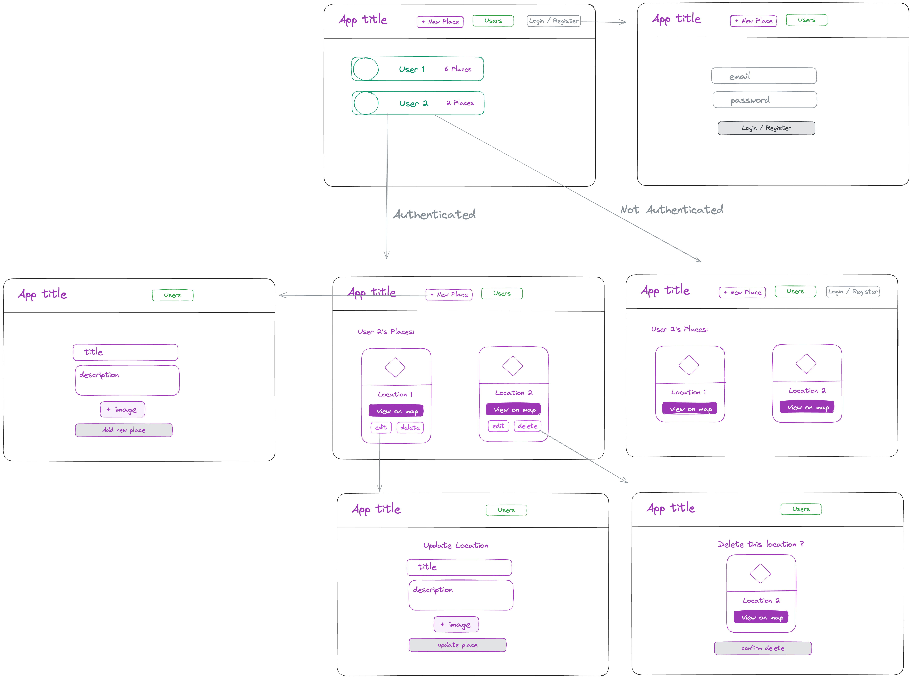
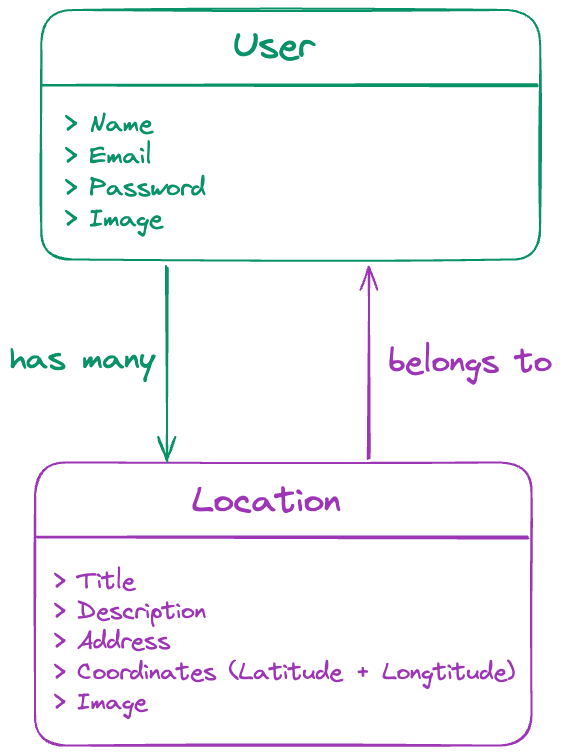

# PlaceBook

<!-- 
image source:  -->

## Overview

1. [Description](#description)
2. [Deployment Link](#deployment-link)
3. [Installation](#installation)
4. [Technologies Used](#technologies)
5. [Deliverables](#deliverables)
6. [Planning & Build Process](#planning)
7. [Challenges](#challenges)
8. [Wins](#wins)
9. [Key Learnings & Takeaways](#takeaways)
10. [Future Improvements](#future-improvements)

---

##  1. Description

<!-- 

image source:  -->

##  2. Deployment Link

:link:&nbsp; https://placebook.katieloesch.co.uk/

backend repository - https://github.com/katieloesch/placebook-backend

##  3. Installation

##  4. Technologies Used

### Core Technologies

This application was built using the `MERN stack`, an open source–centric collection of technologies that uses `JavaScript` for both the browser and server sides of a web application:

- **Frontend**
  - **React.js** (v18.3.1)
  - A JavaScript library for building user interfaces, particularly single-page applications where efficient and dynamic rendering of components is crucial.
    - [website](https://react.dev/)
    - [GitHub repository](https://github.com/reactjs/react.dev)
- **Backend**
  - **Express.js** (v4.19.2)
    - A fast and minimalist web framework for Node.js, used to build web applications and APIs.
    - [npm page](https://www.npmjs.com/package/express)
    - [GitHub repository](https://github.com/expressjs/express)
    -  [website](https://expressjs.com/)
  - **Node.js** (v20.14.0)
    - A JavaScript runtime built on Chrome's V8 JavaScript engine, allowing developers to use JavaScript to build server-side applications with event-driven, non-blocking I/O.
    - [website](https://nodejs.org)
    - [GitHub Repository](https://github.com/nodejs)
- **Database**
  - **MongoDB / MongoDB Atlas** (v7.0.12)
    - MongoDB: a document-oriented NoSQL database designed for scalability and flexibility, making it easy to store and retrieve large volumes of structured and semi-structured data.
    - MongoDB Atlas: a fully managed cloud-based service that hosts and manages MongoDB databases, provided by the creators of MongoDB.
    - [MongoDB website](https://www.mongodb.com/)
    - [MongoDB GitHub Repository](https://github.com/mongodb/mongo)
    - [MongoDB Atlas website](https://www.mongodb.com/cloud/atlas/register)
  - **Mongoose** (v8.5.3)
    - A MongoDB object modeling tool designed to work in an asynchronous environment, providing schema-based solutions to model data in a MongoDB database.
    - [npm page](https://www.npmjs.com/package/mongoose)
    - [GitHub repository](https://github.com/Automattic/mongoose)
    -  [website](https://mongoosejs.com/)
    - [mongoDB](https://www.mongodb.com/developer/languages/javascript/getting-started-with-mongodb-and-mongoose/)

### Key Dependencies - Frontend

- **react-router-dom** (v6.24.0)
  - An implementation of react-router that includes additional components for browser-based routing
  - [npm page](https://www.npmjs.com/package/react-router-dom)
  - [GitHub repository](https://github.com/remix-run/react-router)
  -  [website](https://reactrouter.com/en/main)
- **react-transition-group** (v4.4.5)
  - A library for handling animations and transitions in React applications
  - [npm page](https://www.npmjs.com/package/react-transition-group)
  - [GitHub repository](https://github.com/reactjs/react-transition-group)
  -  [website](https://reactcommunity.org/react-transition-group/)
- **sass** (v1.77.8)
  - A CSS preprocessor used for styling the application
  - [npm page](https://www.npmjs.com/package/sass)
  - [GitHub repository](https://github.com/sass/dart-sass)

### Key Dependencies - Backend

- **axios** (v1.7.4)
  - A promise-based HTTP client for Node.js and the browser that simplifies making asynchronous HTTP requests to REST endpoints.
  - [npm page](https://www.npmjs.com/package/axios)
  - [GitHub repository](https://github.com/axios/axios)
  -  [website](https://axios-http.com/)
- **body-parser** (v1.20.2)
  - A Node.js body parsing middleware, supporting JSON and URL-encoded data.
  - [npm page](https://www.npmjs.com/package/body-parser)
  - [GitHub repository](https://github.com/expressjs/body-parser)
- **bcryptjs** (v2.4.3)
  - A JavaScript library for hashing and comparing passwords securely using the bcrypt algorithm.
  - [npm page](https://www.npmjs.com/package/bcryptjs)
  - [GitHub repository](https://github.com/dcodeIO/bcrypt.js)
- **dotenv** (v16.4.5)
  - A zero-dependency module that loads environment variables from a .env file into process.env, allowing secure configuration settings management.
  - [npm page](https://www.npmjs.com/package/dotenv)
  - [GitHub repository](https://github.com/motdotla/dotenv)
  -  [website](https://dotenvx.com/)
- **express** (v4.19.2)
  - A fast and minimalist web framework for Node.js, used to build web applications and APIs.
  - [npm page](https://www.npmjs.com/package/express)
  - [GitHub repository](https://github.com/expressjs/express)
  -  [website](https://expressjs.com/)
- **express-validator** (v7.2.0)
  - A set of express.js middleware functions that offer a way to validate and sanitise input data, helping to prevent common security vulnerabilities.
  - [npm page](https://www.npmjs.com/package/express-validator)
  - [GitHub repository](https://github.com/express-validator/express-validator)
  -  [website](https://express-validator.github.io/docs)
- **jsonwebtoken** (v9.0.2)
  - A library for creating, signing, and verifying JSON Web Tokens (JWTs), which are used for securely transmitting information between parties.
  - [npm page](https://www.npmjs.com/package/jsonwebtoken)
  - [GitHub repository](https://github.com/auth0/node-jsonwebtoken)
  -  [website (JsonWebToken implementation for node.js)](https://self-issued.info/docs/draft-ietf-oauth-json-web-token.html)
- **mongoose** (v8.5.3)
  - A MongoDB object modeling tool designed to work in an asynchronous environment, providing schema-based solutions to model data in a MongoDB database.
  - [npm page](https://www.npmjs.com/package/mongoose)
  - [GitHub repository](https://github.com/Automattic/mongoose)
  -  [website](https://mongoosejs.com/)
- **mongoose-unique-validator** (v5.0.1)
  - A Mongoose plugin that adds pre-save validation for unique fields within a Mongoose schema, ensuring unique constraints are respected.
  - [npm page](https://www.npmjs.com/package/mongoose-unique-validator)
  - [GitHub repository](https://github.com/mongoose-unique-validator/mongoose-unique-validator)
- **multer** (v1.4.5-lts.1)
  - A middleware for handling multipart/form-data, commonly used for uploading files in Express.js applications.
  - [npm page](https://www.npmjs.com/package/multer)
  - [GitHub repository](https://github.com/expressjs/multer)
- **nodemon** (v3.1.4)
  -  A utility that automatically restarts your Node.js server when files change, making development faster and more efficient.
  - [npm page](https://www.npmjs.com/package/nodemon)
  - [GitHub repository](https://github.com/remy/nodemon)
  - [website](https://nodemon.io/)
- **uuid** (v10.0.0)
  -  A library that generates RFC-compliant universally unique identifiers (UUIDs) for use in various applications where unique identification is required.
  - [npm page](https://www.npmjs.com/package/uuid)
  - [GitHub repository](https://github.com/uuidjs/uuid)

### UI and Design

- **Fonts**:

- **Icons**
  - **Iconify**
    - A free and open-source framework providing access to a vast number of icons, designed for use across various platforms and environments, including React.
    - [website](https://icon-sets.iconify.design/)
    - [GitHub repository](https://github.com/iconify/iconify/tree/main)
    - [license](https://github.com/iconify/iconify/blob/main/license.txt)
  - **Font Awesome**
    - An icon library offering a large set of scalable and customisable icons, with a free version that is open source.
    - [website](https://fontawesome.com/)
    - [GitHub repository](https://github.com/FortAwesome/Font-Awesome)
    - [license](https://fontawesome.com/license/free)

### Development Tools

- **Git / GitHub**
  - Used for version control and collaboration.
  - [Git website](https://git-scm.com/)
  - [GitHub website](https://github.com/)
- **Visual Studio Code (VSCode)**
  - Code editor used for development.
  - [website](https://code.visualstudio.com/)
  - [GitHub repository](https://github.com/microsoft/vscode)
- **Google Chrome & Chrome DevTools**
  - Used for testing, debugging, and developing in the browser.
  - [Google Chrome website](https://www.google.com/chrome/)
  - [Chrome DevTools documentation](https://developer.chrome.com/docs/devtools)
- **serve**
  - Runs a script to start a local static file server, used to preview production builds of frontend app.
  - [Google Chrome website](https://www.google.com/chrome/)
  - [Chrome DevTools documentation](https://developer.chrome.com/docs/devtools)
- **Excalidraw**
  - Tool used to create wireframes for the application.
  - [website](https://excalidraw.com/)
  - [GitHub repository](https://github.com/excalidraw/excalidraw)
- **ChatGPT4o**:
  - Generative AI tool used for debugging and development support.
  - [website](https://chat.openai.com/)
  - [GitHub repository](https://github.com/openai)

### Deployment

- Frontend - **Hostinger**
  - Web hosting service that offers shared, cloud, and VPS hosting solutions for websites, domains, and custom applications
  - [UK website](https://www.hostinger.co.uk)
  - [US website](https://www.hostinger.com/)
- Backend - **Heroku**
  - Cloud platform that enables developers to build, run, and scale applications by abstracting away server infrastructure management
  - [website](https://www.heroku.com/)
  - [GitHub repository](https://github.com/heroku)

### Resources and tutorials

- **Documentation**
  - [axios](https://axios-http.com/docs/intro)
- **Udemy**
  - [React, NodeJS, Express & MongoDB - The MERN Fullstack Guide](https://www.udemy.com/course/react-nodejs-express-mongodb-the-mern-fullstack-guide/?couponCode=OF83024F) by [Manuel Lorenz](https://www.udemy.com/user/manuel-lorenz/) & [Maximilian Schwarzmüller](https://www.udemy.com/user/maximilian-schwarzmuller/)
  - [React - The Complete Guide 2024 (incl. Next.js, Redux)](https://www.udemy.com/course/react-the-complete-guide-incl-redux/learn/lecture/25595350?start=0#overview) by [Maximilian Schwarzmüller](https://www.udemy.com/user/maximilian-schwarzmuller/)
  - [MERN 2024 Edition - MongoDB, Express, React and NodeJS](https://www.udemy.com/course/mern-stack-course-mongodb-express-react-and-nodejs/) by [John Smilga](https://www.udemy.com/user/janis-smilga-3/)
  - [The Complete Node.js Developer Course (3rd Edition)](https://www.udemy.com/course/the-complete-nodejs-developer-course-2/) by [Andrew Mead](https://www.udemy.com/user/andrewmead/) & [Rob Percival](https://www.udemy.com/user/robpercival/)

##  5. Deliverables

### MVP

#### 1. Authentication & Authorization

- Secure sign-up and login with JWT-based authentication
- Password hashing
- Role-based access control to protect user-specific data and routes

#### 2. Full CRUD operations for places:

- Create new places with title, description, and address
- Upload an image associated with each place
- Edit or delete only the user’s own places
- View all users and their shared places

#### 3. Frontend

- Responsive design with a clean, intuitive layout
- Context API for global state management
- Custom hooks for HTTP requests and form handling
- Real-time image preview during place creation
- Data validation for form inputs
- Interactive map display using Google Maps API to visualize location data

#### 4. Backend

- RESTful API with modular routing, structured error handling, and data validation
- Data validation and sanitization
- Data storage using MongoDB and hosting via MongoDB Atlas

#### 5. Deployment

- Independent deployment of frontend and backend

### Potential Extra Features / Stretch Goals

- File upload for user profile picture
- User profile page
- Dark mode toggle
- Pagination for places
- Refresh token and token renewal system
- Cloudinary or S3 for cloud image storage
- Optimize image sizes automatically on upload
- Unit and integration tests (e.g. Jest, React Testing Library, Supertest)

### User stories

#### Authentication & Access Control

- As a user, I should be able to sign up with my email and password, so that I can create an account and start sharing places.
- As a user, I should be able to log in securely, so that I can access and manage my content.
- As a user, I should be automatically logged out when my token expires, so that my account stays secure.
- As a user, I should only be able to access protected pages if I’m authenticated.

#### Place Management

- As a user, I should be able to add a new place with a title, description, address, and image, so that I can share locations I’ve visited.
- As a user, I should be able to see the address I entered on a map.
- As a user, I should be able to upload an image when creating a place.
- As a user, I should be able to preview my image before uploading it.
- As a user, I should be able to edit or delete a place, so that I can keep my content accurate and up to date.
- As a user, I should be able to view a list of all places shared by a specific user, so that I can see what others have shared.

### User Experience & Interface

- As a user, I should be able to use the app comfortably on any device.
- As a user, I should be able to see loading spinners during data fetches, so that I know the app is working.
- As a user, I should be able to see error messages and modals when something goes wrong, so that I understand what’s happening and how to fix it.

##  6. Planning & Build Process

### wireframe

### ERD

##  7. Challenges

- Authorization Logic: Ensuring that only the original creator of a post could edit or delete their own content required careful implementation of role checks and user ID validation on both the client and server sides.
- CORS Configuration for Cross-Origin Requests: Allowing the frontend and backend to communicate across different domains required configuring CORS headers and handling preflight OPTIONS requests.
- Address Geocoding: Converting user-entered addresses into geo-coordinates for map display involved integrating a geocoding API, managing fallback behaviour, and gracefully handling errors or ambiguous results.
- Conditional Routing Based on Auth State: Dynamically rendering routes and navigation links based on the user's authentication status involved using React Context, route guards, and maintaining consistent state across components.
- File and Error Cleanup: Ensuring that uploaded files weren’t left orphaned after failed requests or remained after their associated places were deleted required implementing cleanup logic both during error handling and on resource deletion.

##  8. Wins

- Implemented role-based access control and JWT-based authentication with hashed passwords using bcryptjs, ensuring secure user login and registration.
- Achieved full CRUD functionality and integrated the Google Maps API to convert user-provided addresses into geo-coordinates, rendering them on a dynamic map.
- Created custom React hooks to encapsulate HTTP request and form logic, resulting in cleaner and reusable code.
- Delivered a fully responsive user interface that works across both desktop and mobile devices.
- Successfully deployed the frontend and backend independently on separate platforms.

##  9. Key Learnings & Takeaways

- Managed to build a full-stack MERN application from scratch, understanding how frontend and backend systems interact.
- Learned how to implement secure authentication using JWTs and password hashing with bcryptjs, including route protection on both client and server sides.
- Gained experience bridging frontend UX with real-world data services by integrating the Google Maps API to dynamically convert addresses into coordinates and display them on an interactive map
- Developed custom React hooks to abstract logic for HTTP requests and form handling, reinforcing the value of modular, reusable code.
- Deepened my understanding of CORS, environment variables, and cross-origin cookie/session strategies by deploying and debugging a split-stack MERN app

##  10. Future Improvements

- Testing Suite: Implement unit and integration tests using tools e.g. Jest, React Testing Library, Supertest
- Cloud Image Storage: Migrate image uploads to cloud-based solutions like Cloudinary or AWS S3
- Admin Dashboard: Develop an admin interface to view, manage, and moderate all user-generated content.
- Pagination: Introduce pagination for user and place listings to improve performance and user experience on data-heavy pages.
- Dark Mode: Introduce a dark mode toggle to accommodate user preferences.
- Accessibility Enhancements: Conduct accessibility audits and implement features such as keyboard navigation, screen reader compatibility, and ARIA roles to ensure an inclusive user experience.

<!--

### day 1: 29/06/2024

- create-react-app
- wireframe
- erd

### day 2: 02/07/2024

modal

### 26/07/2024

- modal to confirm deletion
- switch to single quotes
- refactoring folder structure/imports

### resources + tutorials

- [React, NodeJS, Express & MongoDB - The MERN Fullstack Guide](https://www.udemy.com/course/react-nodejs-express-mongodb-the-mern-fullstack-guide/) by [Manuel Lorenz](https://www.udemy.com/user/manuel-lorenz/) & [Maximilian Schwarzmüller](https://www.udemy.com/user/maximilian-schwarzmuller/)

28/08/2024
connect frontend +backend

 -->
